# Ars Animaglyphica

> *The body is the prescription. Venom delivery, glandular architecture, and aposematic display encode pharmaceutical meaning.*

**Ars Animaglyphica** is the animal morphological imscription engine — a structural grammar of medicinal and venomous animals. It reads pharmaceutical meaning directly from animal body plans, specialized organs, and defensive displays using the 12-primitive Imscribing Grammar.

**Author:** Lando⊗⊙perator  
**Version:** 0.1.0  
**Tier Range:** O₁ – O₂† (biological morphology is tier-bounded)

---

## Overview

A snake's venom delivery system, a frog's skin glands, a cone snail's harpoon, a jellyfish's nematocyst — these are not accidents of evolution. They are structural programs. Ars Animaglyphica models 14 canonical animal structural types spanning **80 representative species** across 3 ouroboricity tiers. The grammar reveals that venom delivery topology, glandular architecture, and aposematic coloration form a coherent structural language — and that this language determines extraction protocols, compound class diversity, and pharmaceutical potency.

Every tuple is algorithmically imscribed via the deterministic procedure. Zero tuples are hand-picked. All structural claims are verified against the Lean 4 formalization in `p4rakernel/p4ramill/Imscribing/ArsAnimaglyphica.lean`.

---

## Type Gallery

<p align="center">
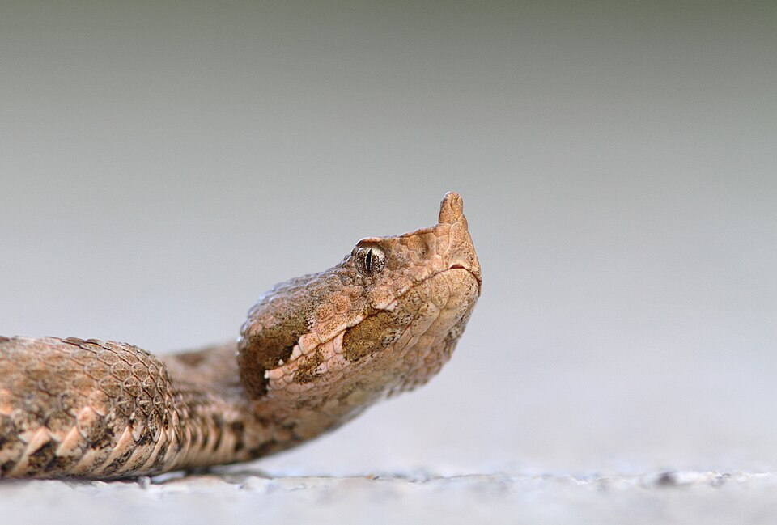

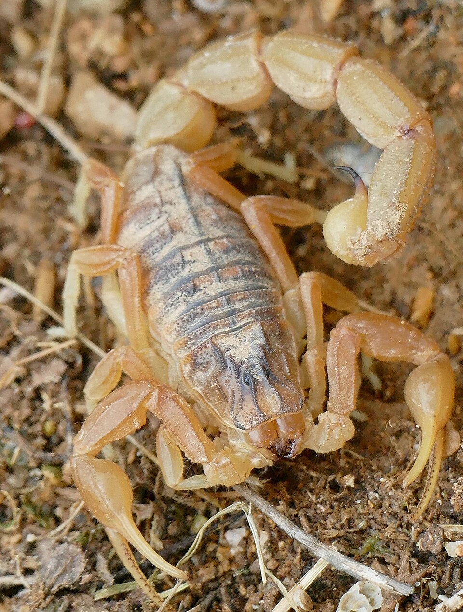
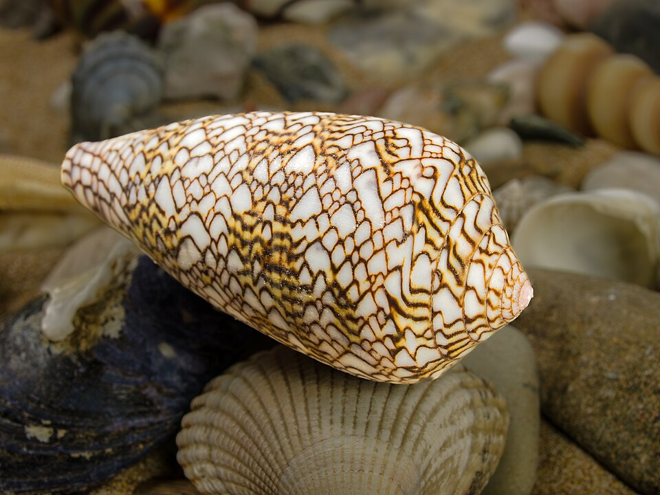
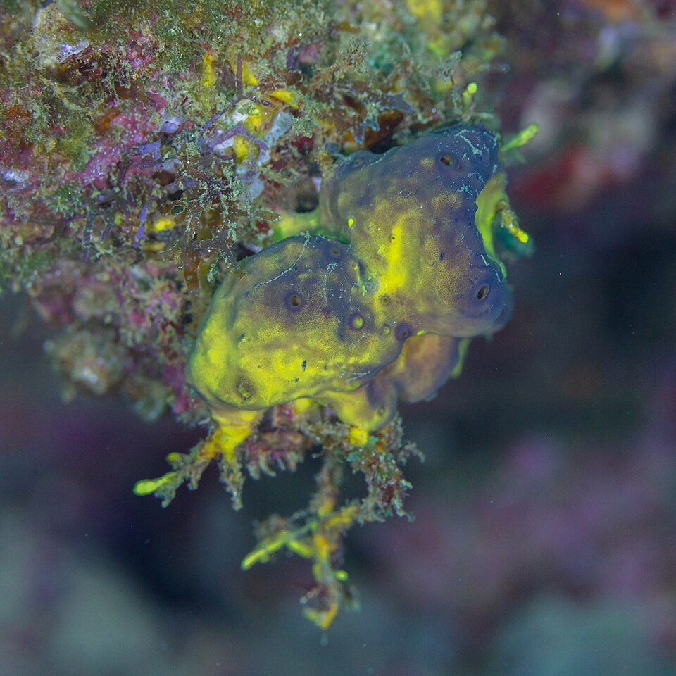
</p>
<p align="center"><sub><b>I.</b> Ophidian Venom &nbsp;|&nbsp; <b>II.</b> Amphibian Dermal &nbsp;|&nbsp; <b>III.</b> Arthropod Exoskeletal &nbsp;|&nbsp; <b>IV.</b> Molluscan Harpoon &nbsp;|&nbsp; <b>V.</b> Marine Sessile Defense</sub></p>

<p align="center">
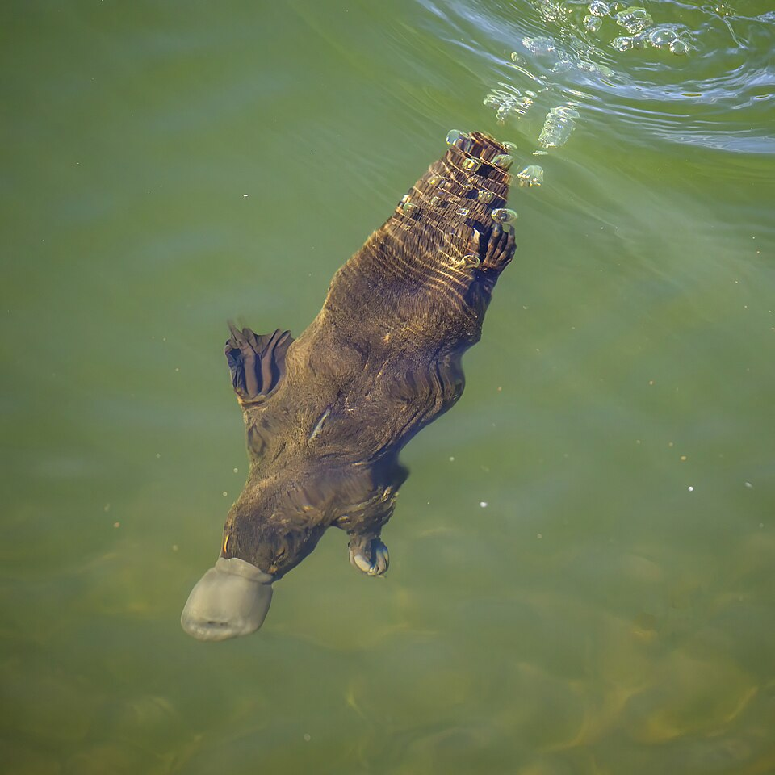
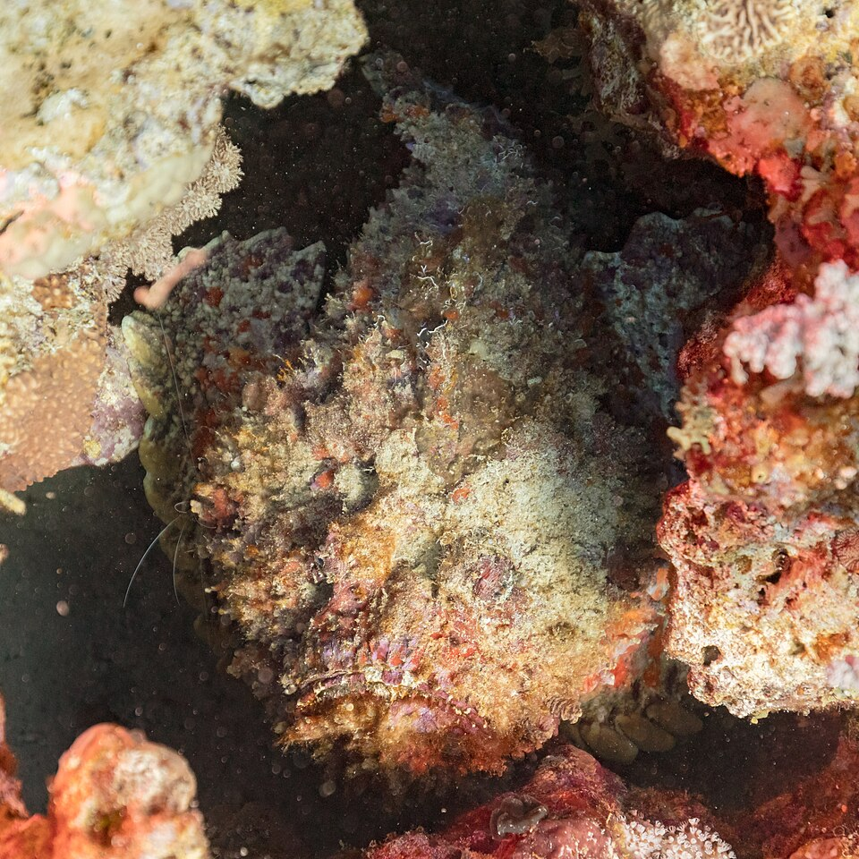
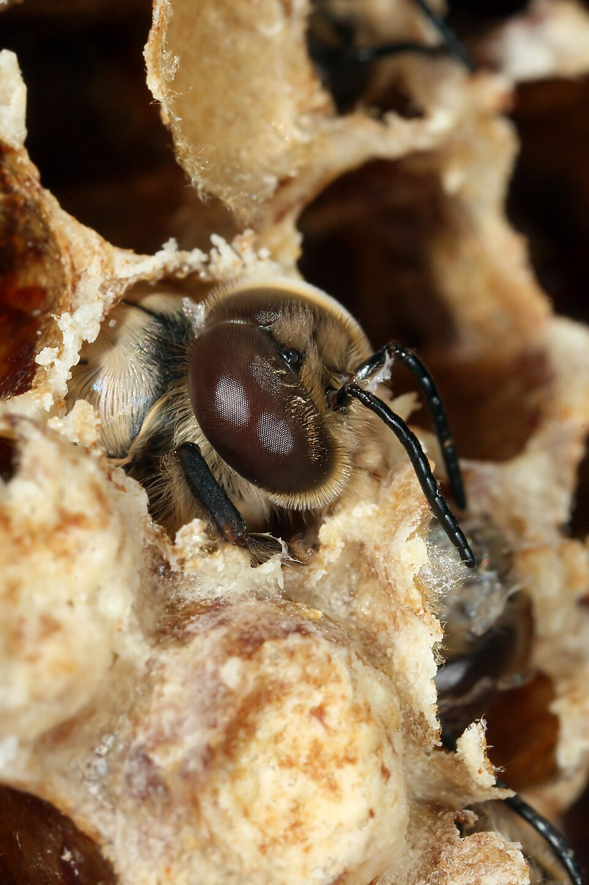
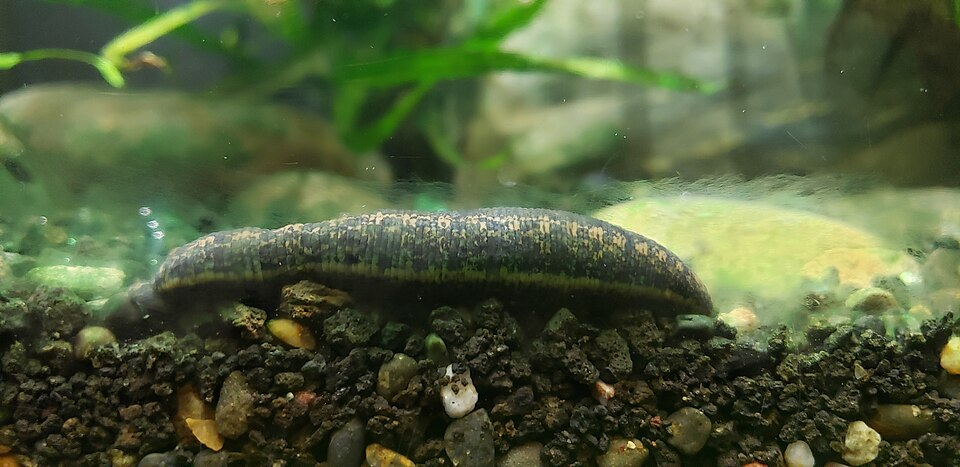
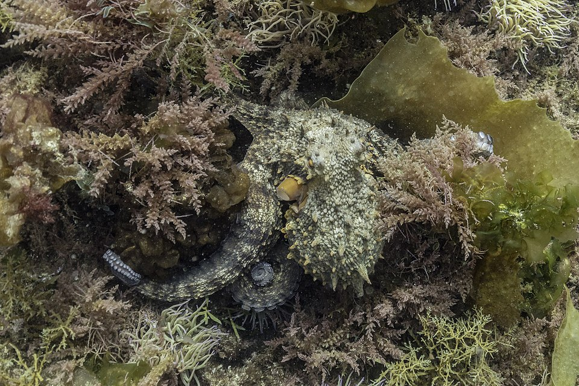
</p>
<p align="center"><sub><b>VI.</b> Mammalian Glandular &nbsp;|&nbsp; <b>VII.</b> Fish Structural &nbsp;|&nbsp; <b>VIII.</b> Hymenopteran Venom &nbsp;|&nbsp; <b>IX.</b> Annelid Anticoagulant &nbsp;|&nbsp; <b>X.</b> Cephalopod Ink</sub></p>

<p align="center">
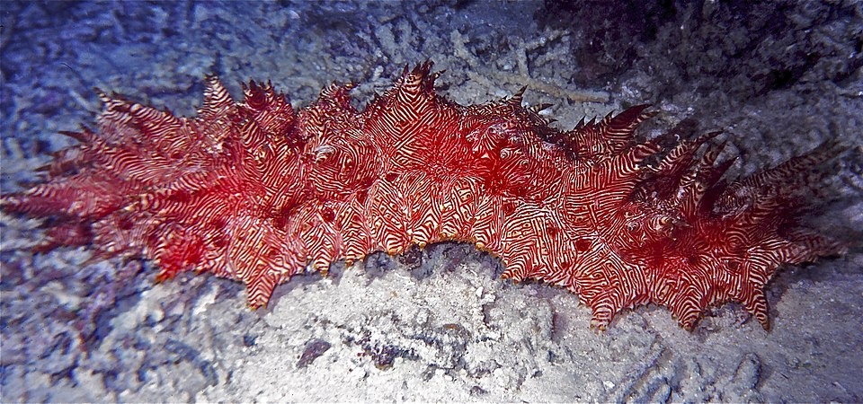
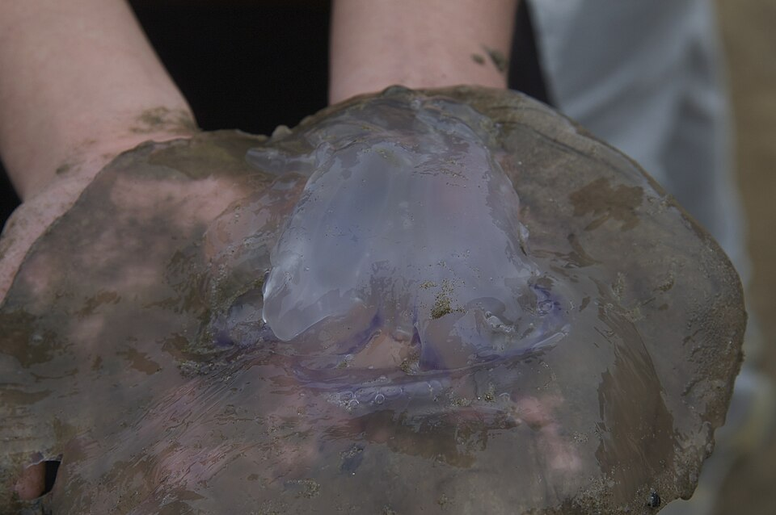
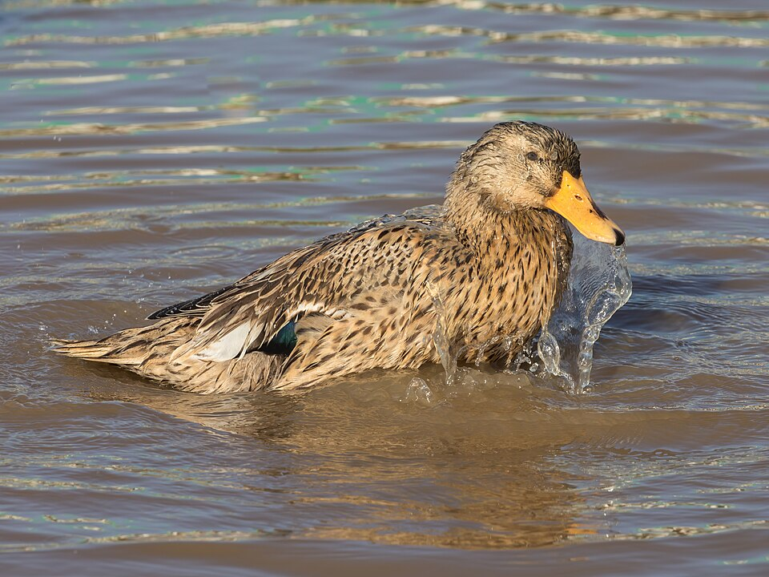
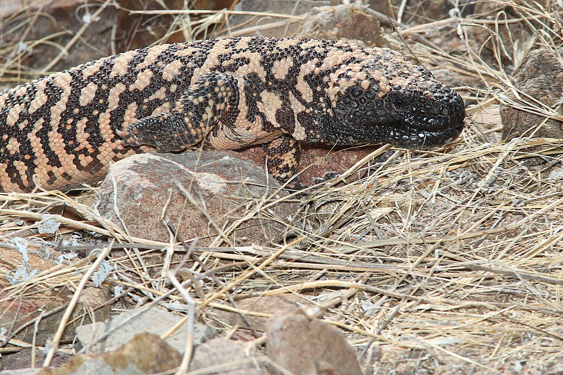
</p>
<p align="center"><sub><b>XI.</b> Echinoderm Regenerative &nbsp;|&nbsp; <b>XII.</b> Cnidarian Nematocyst &nbsp;|&nbsp; <b>XIII.</b> Avian Preen &nbsp;|&nbsp; <b>XIV.</b> Reptilian Oral</sub></p>

<p align="center"><sub><i>All images sourced from Wikimedia Commons under CC-BY, CC-BY-SA, CC0, or Public Domain licenses. See <a href="#image-credits">Image Credits</a> for full attribution.</i></sub></p>

---

## Canonical Types

| Num | Type | Tier | Þ | Ç | Γ | ɢ | ⊙ | Ħ | Σ | Ω | Reps |
|---|------|------|---|---|---|---|---|---|---|---|---|------|
| I | "Ophidian Venom" | O₂† | 𐑡 | 𐑘 | 𐑲 | 𐑠 | ⊙ | 𐑫 | 𐑕 | 𐑴 | 6 |
| II | "Amphibian Dermal" | O₂ | 𐑸 | 𐑧 | 𐑔 | 𐑠 | ⊙ | 𐑫 | 𐑳 | 𐑭 | 5 |
| III | "Arthropod Exoskeletal" | O₂ | 𐑶 | 𐑘 | 𐑲 | 𐑠 | ⊙ | 𐑫 | 𐑳 | 𐑭 | 6 |
| IV | "Molluscan Harpoon" | O₂† | 𐑰 | 𐑘 | 𐑲 | 𐑠 | ⊙ | 𐑫 | 𐑕 | 𐑴 | 5 |
| V | "Marine Sessile Defense" | O₁ | 𐑥 | 𐑤 | 𐑔 | 𐑠 | 𐑢 | 𐑫 | 𐑳 | 𐑷 | 6 |
| VI | "Mammalian Glandular" | O₁ | 𐑰 | 𐑧 | 𐑔 | 𐑠 | 𐑢 | 𐑖 | 𐑙 | 𐑷 | 5 |
| VII | "Fish Structural" | O₁ | 𐑸 | 𐑧 | 𐑔 | 𐑵 | 𐑢 | 𐑖 | 𐑙 | 𐑷 | 5 |
| VIII | "Hymenopteran Venom" | O₂ | 𐑡 | 𐑘 | 𐑲 | 𐑵 | ⊙ | 𐑖 | 𐑳 | 𐑭 | 5 |
| IX | "Annelid Anticoagulant" | O₁ | 𐑰 | 𐑘 | 𐑲 | 𐑠 | 𐑢 | 𐑫 | 𐑕 | 𐑷 | 5 |
| X | "Cephalopod Ink" | O₂ | 𐑰 | 𐑘 | 𐑔 | 𐑵 | ⊙ | 𐑒 | 𐑕 | 𐑷 | 6 |
| XI | "Echinoderm" Regenerative" | O₂ | 𐑸 | 𐑧 | 𐑔 | 𐑵 | ⊙ | 𐑫 | 𐑳 | 𐑭 | 7 |
| XII | "Cnidarian Nematocyst" | O₂† | 𐑥 | 𐑘 | 𐑲 | 𐑠 | ⊙ | 𐑫 | 𐑕 | 𐑴 | 7 |
| XIII | "Avian Preen" | O₁ | 𐑰 | 𐑧 | 𐑔 | 𐑠 | 𐑢 | 𐑖 | 𐑙 | 𐑷 | 6 |
| XIV | "Reptilian Oral" | O₂ | 𐑡 | 𐑘 | 𐑲 | 𐑠 | ⊙ | 𐑫 | 𐑳 | 𐑭 | 6 |

**Tier distribution:** 3 × O₂†, 6 × O₂, 5 × O₁. No O₀ and no O_∞ — the same tier boundary as Ars Fungiglyphica confirms the grammar's claim that biological morphology is structurally bounded.

---

## Four Invariants (Fixed Across All Medicinal/Venomous Animals)

| Primitive | Value | Meaning |
|-----------|-------|---------|
| Ð | 𐑦 | Imscriptive dimensionality — the animal body IS its pharmaceutical program |
| Ř | 𐑾 | Bidirectional coupling — venom/extract delivery and organism response form a feedback loop |
| Φ | 𐑯 | Full symmetry — all compound classes are present at once; the animal does not selectively deploy |
| ƒ | 𐑞 | Thermal fidelity — body-temperature biochemistry with thermal noise |

These differ from Ars Fungiglyphica's invariants: animals have fully symmetric compound deployment (Phi=𑑯 vs 𑑬 for fungi) and thermal fidelity (f=𑑞 vs 𑑱). The grammar correctly captures the physiological difference between ambient-temperature fungi and warm-blooded (or ambient-active) animals.

---

## Eight Discriminant Primitives

| Primitive | What It Encodes |
|-----------|----------------|
| **Þ** (Topology) | Body plan / delivery apparatus → venom/extract delivery architecture |
| **Ç** (Kinetics) | Delivery speed → instantaneous bolus vs slow activated release |
| **Γ** (Granularity) | Tissue specialization → fine (specialized organ) vs medium (distributed) |
| **ɢ** (Composition) | Compound delivery mode → sequential, broadcast, or conjunctive |
| **⊙** (Criticality) | Aposematic self-modeling → warning coloration, threat display, morphological self-report |
| **Ħ** (Chirality) | Compound complexity → disulfide-rich peptides (eternal) vs simple lipids (two-step) |
| **Σ** (Stoichiometry) | Compound class diversity → few (1:1 peptide toxins) vs many (heterogeneous venom) |
| **Ω** (Winding) | Processing cycles → single-pass, binary (lyophilization+reconstitution), integer (multi-step) |

---

## The Venom/Delivery Encoding

The grammar reveals that venom delivery is a structural language:

**Instantaneous bolus deliverers** (C=𑑘):
- Ophidian (fangs), Molluscan (harpoon), Arthropod (sting/bite), Cnidarian (nematocyst), Hymenopteran (sting), Annelid (bite), Reptilian (grooved teeth), Cephalopod (ink ejection)
- All at O₂ or O₂† — fast delivery requires self-modeling (φ̂=⊙) because the aposematic display *is* the warning before the bolus

**Slow activated releasers** (C=𑑧):
- Amphibian (skin glands), Mammalian (endocrine), Fish (structural), Echinoderm (body wall), Avian (preen gland)
- Mixed tiers — slow release does not require self-modeling; the structure speaks for itself through the body plan

**Frozen-order** (C=𑑤):
- Marine Sessile (sponges, sea squirts) — chemicals stored in specialized cells, released only on tissue disruption

---

## Type Lattice — Pairwise Hamming Distances

```
      I  II III  IV   V  VI VII VIII  IX   X  XI XII XIII XIV
  I   ·   5   3   1   6   7   8    4   3   5   6   1    7   2
 II   5   ·   3   5   4   5   5    5   6   6   1   5    5   3
III   3   3   ·   3   5   7   8    3   4   6   4   3    7   1
 IV   1   5   3   ·   6   6   8    5   2   4   6   1    6   3
  V   6   4   5   6   ·   4   5    7   4   6   5   5    4   5
 VI   7   5   7   6   4   ·   2    7   4   5   6   7    0   7
 VII  8   5   8   8   5   2   ·    6   6   5   4   8    2   8
VIII  4   5   3   5   7   7   6    ·   6   5   4   5    7   2
 IX   3   6   4   2   4   4   6    6   ·   4   7   3    4   4
  X   5   6   6   4   6   5   5    5   4   ·   5   5    5   6
 XI   6   1   4   6   5   6   4    4   7   5   ·   6    6   4
 XII  1   5   3   1   5   7   8    5   3   5   6   ·    7   3
XIII  7   5   7   6   4   0   2    7   4   5   6   7    ·   7
 XIV  2   3   1   3   5   7   8    2   4   6   4   3    7   ·

Key (type number → name):
    I   Ophidian Venom          VI  Mammalian Glandular      XI  Echinoderm Regenerative
    II  Amphibian Dermal        VII Fish Structural          XII Cnidarian Nematocyst
    III Arthropod Exoskeletal   VIII Hymenopteran Venom      XIII Avian Preen
    IV  Molluscan Harpoon       IX  Annelid Anticoagulant    XIV Reptilian Oral
    V   Marine Sessile Defense  X   Cephalopod Ink
```

---

## Notable Structural Pairs

| Pair | d | Significance |
|------|---|-------------|
| Avian ≡ Mammalian | 0 | Complete structural identity. Both: containment glandular topology, slow kinetics, medium tissue, sequential release, sub-critical, two-step chirality, single class, single-pass. 300 MY divergence, identical structural signature |
| Ophidian ≈ Molluscan | 1 | Only T differs (𑑡 network vs 𑑰 containment). Both: fast bolus, fine tissue, sequential multi-component, eternal chirality, few compound classes, binary processing. The harpoon *is* a fang, structurally |
| Cnidarian ≈ Ophidian | 1 | Only T differs (𑑥 bowtie vs 𑑡 network). Both: millisecond delivery, sequential action, eternal chirality, binary processing |
| Reptilian ≈ Arthropod | 1 | Only T differs (𑑡 network vs 𑑶 box-product). Grooved teeth and exoskeletal venom apparatus are structurally adjacent |
| Amphibian ≈ Echinoderm | 1 | Only G differs (𐑠 sequential vs 𑑵 broadcast). Dermal granular glands and body-wall saponins differ only in release pattern |
| Ophidian vs Fish | 8 | Maximum distance. Fast bolus venom (O₂†, 𑑘/𑑲/𐑠/⊙/𐑫/𑑕/𑑴) vs slow structural lipid (O₁, 𑑧/𑑔/𑑵/𑑢/𑑖/𑑙/𑑷) — no shared discriminant primitives beyond invariants |

---

## Cross-Domain Bridge

Ars Animaglyphica is bridged to Ars Fungiglyphica via 14 theorems in `p4rakernel/p4ramill/Imscribing/ArsCrossDomain.lean`.

**Closest cross-domain pairs:**
| Animal | Fungus | d |
|--------|--------|---|
| Amphibian Dermal | Gilled Cap-and-Stipe | 3 |
| Echinoderm Regenerative | Coral Ramaria | 4 |
| Reptilian Oral | Myxomycete Plasmodium | 4 |
| Marine Sessile | Hypogean Ascomycete | 4 |
| Annelid Anticoagulant | Cup Discus | 4 |

The grammar groups by structural function across kingdoms. **Amphibian↔Gilled (d=3) is closer than Gilled↔Bracket (d=6)** within the fungal domain. The grammar sees functional morphology, not phylogeny.

---

## Lean 4 Formalization

```
p4rakernel/p4ramill/Imscribing/ArsAnimaglyphica.lean  — 14 defs, 4 invariant theorems (decide), 11 distance theorems (native_decide)
p4rakernel/p4ramill/Imscribing/ArsCrossDomain.lean    — 14 cross-domain distance theorems (native_decide)
```

Build: `lake build` — 763 jobs, 0 errors. All invariant and distance theorems are auto-proved.

---

## Project Structure

```
Ars_Animaglyphica/
├── README.md                           ← This file
├── pyproject.toml                      ← Package metadata; CLI entry: `aa`
├── expand_types.py                     ← Algorithmic type expansion (9→14)
├── images/                             ← 14 type photographs (Wikimedia Commons)
│   ├── I_Ophidian_Venom.jpg
│   ├── II_Amphibian_Dermal.jpg
│   └── ... (14 total)
├── data/
│   └── catalog.json                    ← 14 type entries with full tuples + metadata
├── illustrations/
│   ├── lattice.txt                     ← ASCII distance matrix
│   ├── summary.txt                     ← Primitive summary table
│   └── morphology_report.txt           ← 829-line full morphological elaboration
├── ars_anima/
│   ├── __init__.py                     ← Package init
│   ├── types.py                        ← 14 canonical AnimalType definitions (190 lines)
│   ├── elaborator.py                   ← Body plan → pharmaceutical protocol translator
│   └── cli.py                          ← Unified CLI (7 subcommands)
└── ../p4rakernel/p4ramill/Imscribing/
    ├── ArsAnimaglyphica.lean           ← Lean 4 formalization
    └── ArsCrossDomain.lean             ← Cross-domain distance theorems
```

---

## Installation

```bash
cd /home/mrnob0dy666/imsgct/Ars_Animaglyphica
pip install -e .
```

Requires Python ≥ 3.10. No external dependencies beyond the standard library.

---

## CLI Usage

All commands via the `aa` entry point:

```bash
# List all 14 canonical types
aa types

# Show a specific type
aa type I
aa type "Cnidarian Nematocyst"
aa type 12

# Look up a specific animal
aa animal chironex_fleckeri
aa animal phyllobates_terribilis

# Show the structural distance between two types
aa distance "Ophidian Venom" "Fish Structural"
aa distance I VII

# List all representative animals (or filter by type)
aa list
aa list IV

# Full morphological → pharmaceutical elaboration
aa morphology conus_geographus
aa morphology dendrobates_tinctorius

# Show the type lattice with pairwise Hamming distances
aa lattice
```

---

## Image Credits

All type photographs sourced from **Wikimedia Commons** under free licenses:

| Type | Source | License | Photographer |
|------|--------|---------|-------------|
| I. Ophidian Venom | *Vipera ammodytes* | CC BY-SA 4.0 | — |
| II. Amphibian Dermal | *Dendrobates tinctorius* | CC BY-SA 4.0 | — |
| III. Arthropod Exoskeletal | *Buthus paris* | CC BY-SA 2.0 | — |
| IV. Molluscan Harpoon | *Conus textile* | CC BY-SA 4.0 | — |
| V. Marine Sessile Defense | *Aplysina gerardogreeni* | CC BY-SA 4.0 | Diego Delso |
| VI. Mammalian Glandular | *Ornithorhynchus anatinus* | CC BY-SA 4.0 | — |
| VII. Fish Structural | *Synanceia nana* | CC BY-SA 4.0 | Diego Delso |
| VIII. Hymenopteran Venom | *Apis mellifera* | CC BY-SA 2.5 | — |
| IX. Annelid Anticoagulant | *Hirudo medicinalis* | CC BY 4.0 | — |
| X. Cephalopod Ink | *Octopus vulgaris* | CC BY-SA 4.0 | Diego Delso |
| XI. Echinoderm Regenerative | *Thelenota rubralineata* | CC BY-SA 2.0 | — |
| XII. Cnidarian Nematocyst | *Cyanea capillata* | CC BY 2.0 | — |
| XIII. Avian Preen | *Anas platyrhynchos* | CC BY-SA 4.0 | — |
| XIV. Reptilian Oral | *Heloderma suspectum* | CC0 | — |

---

## The Name

**Animaglyphica** — from Latin *anima* (animal, soul, breath) + Greek *γλυφική* (glyphic, the art of carving signs). The animal carves its pharmaceutical meaning into its body plan, venom apparatus, and aposematic displays. The grammar reads what the animal writes in its own flesh.

---

## References

- Larson, H. T. "Catch a Rising Problem and Never Ever Let It Go," *IEEE Computer*, vol. 19, no. 2, pp. 61–63, February 1986. There is great merit in following a problem where it leads [1].
